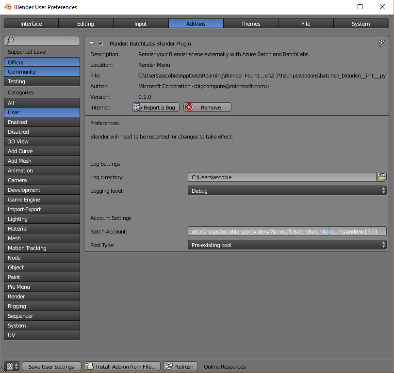

# Azure Batch Rendering
BatchLabs plugin for Blender. This plugin allows you to use BatchLabs and Azure Batch to render your scenes in the cloud.

# BatchLabs
Batch Labs is a tool to manage your Azure Batch accounts. The goal is to implement a great user experience that will help you debug, monitor and manage your pools, jobs and tasks. It also includes expermiental features such as `Batch Templates` in the aim to improve your Batch experience. BatchLabs is updated monthly with new features and bug fixes. You can download it for Windows, macOS, and Linux on [BatchLabs website](https://azure.github.io/BatchLabs/).


## Installing the plugin
These steps will outline how to install and use the Blender plugin.
#### 1. Install BatchLabs
Install the latest version of [BatchLabs](https://azure.github.io/BatchLabs/). This is the tool that will do the majority of the work to get your Blender scenes rendering in the cloud.

#### 2.1 Install the Blender plugin
Get the latest zip file from [the repository](https://github.com/Azure/azure-batch-rendering/tree/master/plugins/blender/blender.client/build). 

- Open the Blender application
- Open the user preferences window: ```File -> User Preferences```
- Click Install Add-on from File button
- Navigate to the plugin zip file you downloaded earlier and select the "Install Add-on from File" button.

**Note:** you will need to check the checkbox to enable the plugin.


#### 2.2 Set the User Preferences
The plugin contains a couple of handy user preferences.



**Log directory** - is where any logs from the plugin will be written to. Note that logs will also be written to the Blender system console that you can view by selecting the following menu: ```Window -> Toggle System Console```

**Log level** - You can set it to ignore basic log messages, but the default of Debug will be fine as there are not that many logs being generated.

**Batch Account** - If you have many Batch accounts and would like the plugin to default to using a single account, you can set the fully qualified resource ID of the account. An example of which would be: /subscriptions/<sub-id>/resourceGroups/<resource-group>/providers/Microsoft.Batch/batchAccounts/<account-name>.

This will ensure that every time you open BatchLabs from the Blender plugin, it will use this account. Otherwise it will default to the last account you were using in BatchLabs.

**Pool Type** - When submitting a job, you can use a persistent pre-existing pool, or an auto-pool that is created when the job is submitted and then deleted when the job is completed. While auto-pools can be handy, they can also make it hard to diagnose some issues with the job should you have any. It is recommended that while you are rendering your test scenes that you use a persistent pool. Once you are happy with the process you can switch to using an auto-pool should you wish.

## Using the plugin
